# Reporte Final del Proyecto 2: Sistema Analítico y de Recomendación sobre Yelp

> **Dataset:** Yelp Open Dataset · **Rango temporal:** 2005-04-10 → 2022-01-19 · **Idioma:** Python nativo (sin sklearn / networkx para algoritmos core)

Este documento es el **Reporte Final** que consolida los hallazgos de todas las partes del proyecto, presentando los resultados obtenidos con sus métricas reales, decisiones de diseño algorítmico y el análisis crítico y ético.
---

## Parte I: Preprocesamiento y Análisis Exploratorio (EDA)

### 1.1 Escala del Dataset y Estrategia de Carga

El dataset de Yelp presenta una escala de datos masivos que exige una estrategia de carga eficiente:

| Entidad | Registros Totales |
|:--------|------------------:|
| Negocios | 150,346 |
| Reseñas (dataset completo) | 6,990,280 |
| Usuarios únicos (dataset completo) | 1,987,929 |

Para procesar los casi **7 millones de reseñas** sin agotar la RAM, se implementó **Reservoir Sampling** (muestreo de reservorio), leyendo el archivo JSON línea por línea en $O(N)$ de tiempo y $O(K)$ de memoria, garantizando representatividad estadística de la muestra con $K = 299,675$ reseñas.

### 1.2 Limpieza Exhaustiva

El pipeline de limpieza aplicó cuatro filtros sobre los datos crudos:

| Tipo de Problema | Registros Eliminados |
|:----------------|---------------------:|
| NaN en campos críticos | 0 |
| Reseñas duplicadas | 214 |
| Estrellas fuera del rango [1–5] | 0 |
| Reseñas huérfanas (sin negocio) | 0 |
| **Reseñas finales tras limpieza** | **299,461** |

La ausencia de NaN y registros huérfanos confirma la alta integridad estructural del dataset de Yelp. Sin embargo, las 214 reseñas duplicadas (doble submit por usuarios) se eliminaron ya que inflan artificialmente la reputación de negocios y distorsionan las métricas de clustering y recomendación.

### 1.3 Análisis Exploratorio por Segmentos Geográficos

El análisis por estado reveló que Pennsylvania (PA) acumula la mayor cantidad de negocios (34,039), seguido de Florida (FL) con 26,330. Los ratings medios por estado son muy similares (3.55 a 3.61 estrellas), lo que indica una distribución de calidad relativamente homogénea entre regiones.

| Estado | Negocios | Stars Promedio | Stars Mediana | Reviews/Negocio |
|:-------|:--------:|:--------------:|:-------------:|:---------------:|
| PA | 34,039 | 3.57 | 3.5 | 45.3 |
| FL | 26,330 | 3.61 | 4.0 | 42.5 |
| TN | 12,056 | 3.57 | 3.5 | 49.6 |
| IN | 11,247 | 3.59 | 4.0 | 42.0 |
| MO | 10,913 | 3.55 | 3.5 | 44.3 |

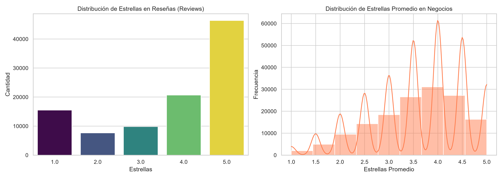
*Figura 1: Distribución de calificaciones. El sesgo positivo hacia 4–5 estrellas refleja un fenómeno conocido como "J-shaped distribution" en plataformas de opinión, donde los consumidores satisfechos revisan más que los insatisfechos.*

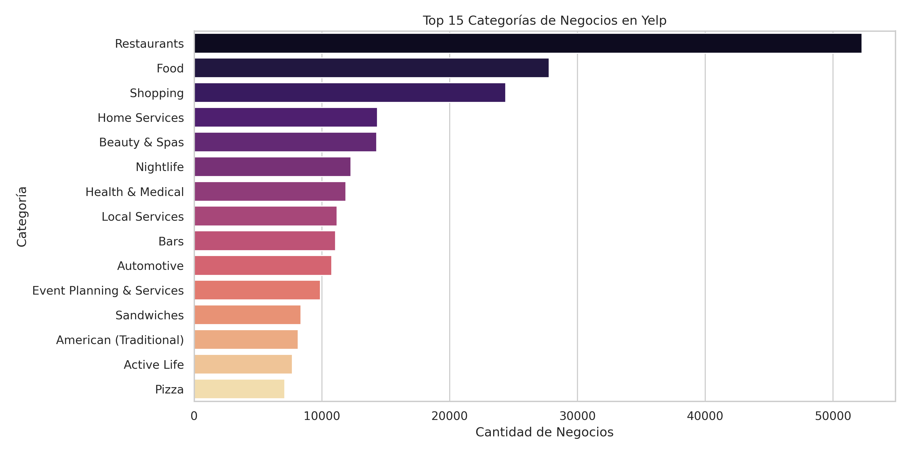
*Figura 2: Top 15 categorías. Restaurants y Food dominan abrumadoramente, seguidas por Nightlife y Bars.*

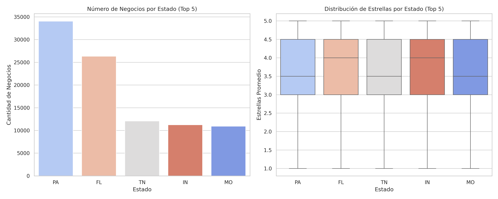
*Figura 3: Análisis geográfico por segmentos en los top 5 estados.*

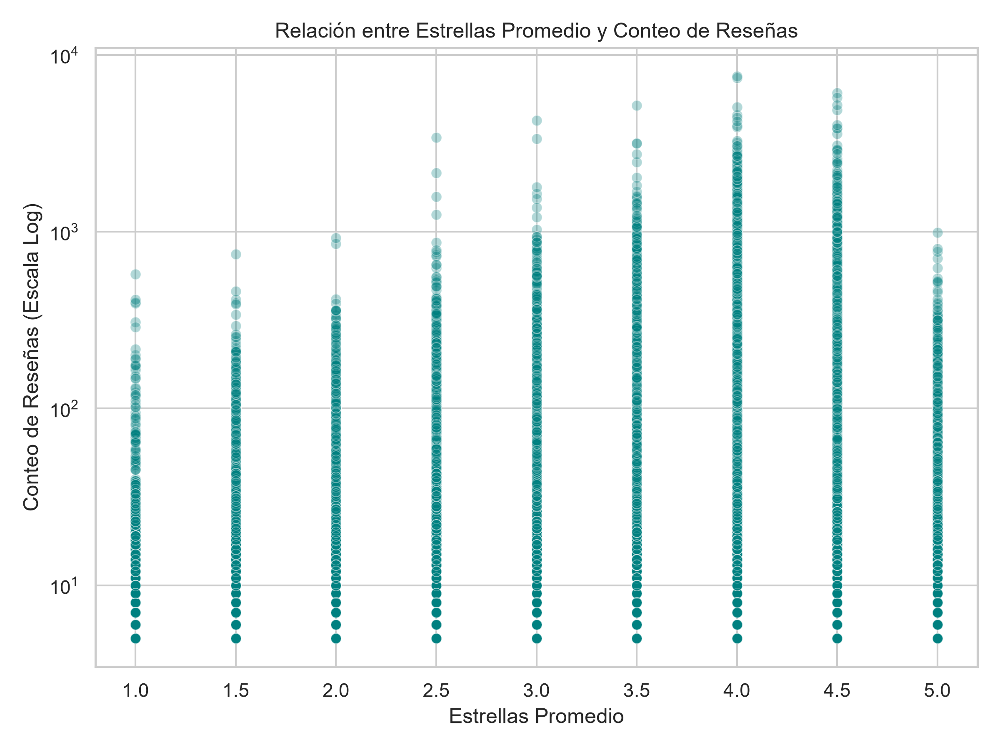
*Figura 4: A mayor volumen de reseñas, más los ratings convergen a la media (3.5–4.5). El efecto "sabiduría de las masas" estabiliza la reputación.*

### 1.4 Análisis de Retención con K-Core

Para determinar el subgrafo óptimo para algoritmos de grafos y clustering, se calculó matemáticamente el **punto de codo del K-Core** iterando sobre los 6.99 millones de reseñas del dataset completo:

- **Codo óptimo matemático:** $K = 4$ (retiene **67.94%** de las conexiones)
- **K seleccionado para el proyecto:** $K = 10$ — justificado porque los algoritmos de la Parte II (PageRank, HITS, Louvain) requieren un grafo altamente denso para convergir correctamente y revelar comunidades significativas.

### 1.5 Métricas del Grafo Bipartito (10-Core)

| Métrica | Valor |
|:--------|------:|
| Nodos Totales | 81,398 |
| Usuarios | 28,313 |
| Negocios | 53,085 |
| Aristas (reseñas) | 759,098 |
| Densidad Estándar | 0.00022914 |
| Densidad Bipartita | 0.00050506 |
| Componentes Conexas | **1** (Grafo Completamente Conexo) |
| Tamaño de la Componente Gigante | 81,398 nodos (**100%**) |
| Diámetro Estimado | **10** saltos |

El resultado de que el **100% de los nodos pertenecen a una sola componente gigante** es un hallazgo relevante: en el ecosistema Yelp, todo negocio con al menos 10 reseñas está indirectamente conectado a todos los demás a través de la red de reseñadores, con un diámetro máximo de 10 saltos.

---

## Parte II: Análisis de Grafos y Ranking

### 2.1 PageRank Iterativo vs HITS: Tipos de Influencia Diferentes

Ambos algoritmos tardaron significativamente:
- **PageRank:** 3.10 segundos sobre 81,398 nodos.
- **HITS:** 52.80 segundos (más costoso computacionalmente por iterar sobre hubs y authorities alternadamente).

#### Top 10 Authorities (HITS) — Negocios más validados

| Rango | Negocio | Score Authority |
|:-----:|:--------|:--------------:|
| 1 | Reading Terminal Market (Philadelphia) | 0.1629 |
| 2 | El Vez (Philadelphia) | 0.1348 |
| 3 | Zahav (Philadelphia) | 0.1317 |
| 4 | Barbuzzo (Philadelphia) | 0.1276 |
| 5 | Parc (Philadelphia) | 0.1229 |

#### Comparación PageRank vs HITS — Hallazgo Clave

| Correlación | Valor | Solapamiento Top-50 |
|:------------|:-----:|:-------------------:|
| Negocios (PageRank vs Authority) | **0.463** | **34%** |
| Usuarios (PageRank vs Hub score) | **0.006** | **0%** |

La **correlación casi nula (0.006) entre PageRank y Hub score en usuarios** revela dos tipos de influencia completamente distintos:
- **PageRank** mide visibilidad global difusa: un usuario con muchas conexiones tiene alto PageRank aunque sus reseñas vayan a negocios mediocres.
- **HITS Hub** mide experticia validada: un usuario es Hub solo si reseña negocios que a su vez son altamente validados por otros Hubs. Es una métrica recursiva de calidad.

### 2.2 Detección de Comunidades con Louvain

El algoritmo convergió en **7.78 segundos** alcanzando una modularidad excepcional:

| Métrica | Valor |
|:--------|------:|
| Modularidad Final (Q) | **0.7793** |
| Comunidades Detectadas | **280** |

Una modularidad $Q > 0.7$ se considera excelente en la literatura, indicando que las particiones encontradas son mucho más densas internamente de lo que se esperaría por azar.

#### Caracterización de las 5 Comunidades Principales

| Com. | Nodos | Usuarios | Negocios | Aristas Int. | Densidad Int. | Ciudad Principal |
|:---:|------:|--------:|--------:|-------------:|:-------------:|:----------------|
| 1 | 23,668 | 8,219 | 15,449 | 220,516 | 1.74 × 10⁻³ | Philadelphia |
| 2 | 13,598 | 4,656 | 8,942 | 123,319 | 2.96 × 10⁻³ | Tampa |
| 3 | 7,422 | 3,181 | 4,241 | 67,531 | 5.01 × 10⁻³ | New Orleans |
| 4 | 6,771 | 2,232 | 4,539 | 57,471 | 5.67 × 10⁻³ | Saint Louis |
| 5 | 6,623 | 2,103 | 4,520 | 62,667 | 6.59 × 10⁻³ | Indianapolis |

- **Nodo más central de la Comunidad 1 (Philadelphia):** Reading Terminal Market — 689 conexiones internas / 827 globales.
- **Nodo más central de la Comunidad 2 (Tampa):** Datz — 454 internas / 496 globales.
- **Nodo más central de la Comunidad 3 (New Orleans):** Acme Oyster House — 370 internas / 559 globales.

Las comunidades más pequeñas tienen densidades internas más altas (hasta $6.59 \times 10^{-3}$ en Indy vs $1.74 \times 10^{-3}$ en Philadelphia), lo cual indica que las ciudades medianas tienen ecosistemas más cohesivos e interconectados.

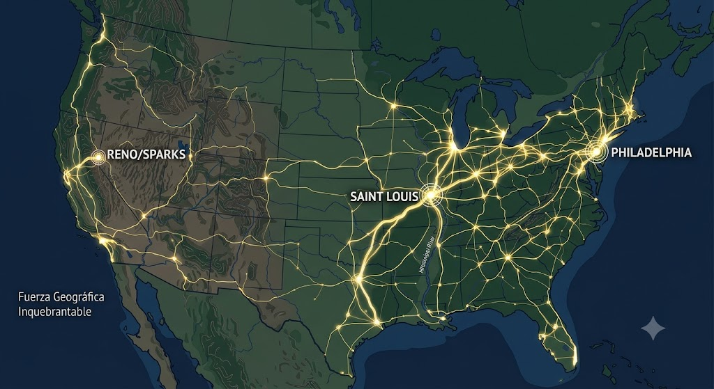
*Figura 5: Comunidades delimitadas geográficamente. El algoritmo de Louvain no recibió coordenadas geográficas como input; las aprendió puramente a partir de co-ocurrencias de usuarios y negocios.*

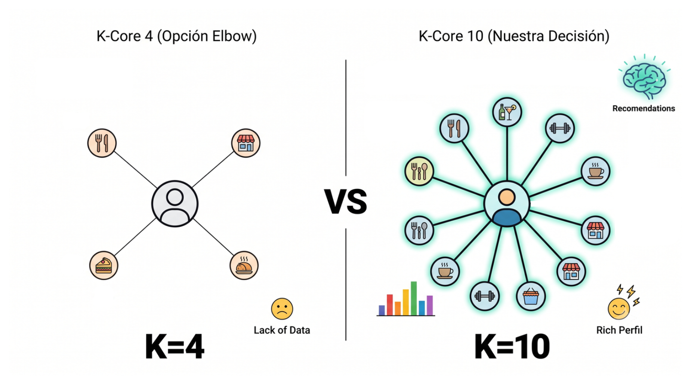
*Figura 6: Visualización del subgrafo 10-Core coloreado por comunidad.*

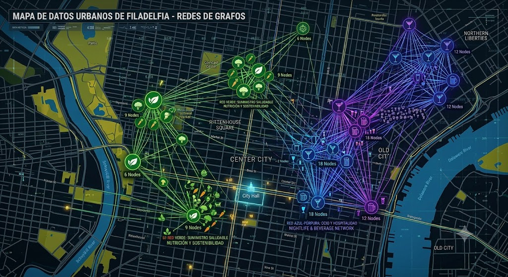
*Figura 7: Dentro de metrópolis densas (Philadelphia), Louvain detectó subcomunidades temáticas.*

---

## Parte VI: Reducción de Dimensionalidad (PCA y SVD)

> *Esta sección se desarrolló en el mismo notebook que el Clustering (Parte III) para reutilizar el espacio de características latentes.*

### 6.1 PCA (Análisis de Componentes Principales)

Se aplicó PCA sobre la matriz de características densa de 1,500 negocios × 22 variables (ratings normalizados + indicadores de categoría). Tras estandarizar y calcular la descomposición espectral de la matriz de covarianza, se retuvo el **90%+ de la varianza** con solo **17 componentes principales** (de 22 originales), una reducción del 22.7%.

#### Interpretación de los Componentes Principales

| CP | Variables de Mayor Carga | Interpretación Semántica |
|:--:|:------------------------|:------------------------|
| **CP 1** | Bars (+0.555), Nightlife (+0.551), Cocktail Bars (+0.321) | Eje de **Vida Nocturna** |
| **CP 2** | Food (−0.455), Coffee & Tea (−0.386), Breakfast & Brunch (−0.376) | Eje de **Cafés y Brunch** |
| **CP 3** | Restaurants (+0.492), Arts & Entertainment (−0.464), Italian (+0.357) | Eje de **Gastronomía vs Entretenimiento** |
| **CP 4** | Pizza (+0.492), Italian (+0.484), Seafood (−0.349) | Eje de **Cocina Italiana/Pizza** |
| **CP 5** | Burgers (+0.484), Mexican (−0.410), American Traditional (+0.371) | Eje de **Comida Americana** |
| **CP 7** | Stars (−0.551), Desserts (+0.427), Seafood (+0.373) | Eje de **Calidad Percibida** |
| **CP 15** | American Traditional (−0.605), review_count_norm (+0.381) | Eje de **Popularidad Masiva** |

El **CP 7 es notable**: tiene alta carga negativa en Stars, lo que implica que negocios con baja calificación (puntaje alto en el eje) son de Desserts y Seafood — sectores con clientes más exigentes y mayor variabilidad de expectativas.

### 6.2 SVD (Descomposición de Valor Singular)

Se construyó la **Matriz Usuario-Producto** de $25,615 \text{ usuarios} \times 1,500 \text{ negocios}$ y se le aplicó SVD para extraer embeddings latentes de negocios:

- **Embeddings extraídos:** shape `(1500, 17)` — 17 dimensiones latentes por negocio, representando factores no obvios que relacionan usuarios con preferencias de consumo.
- **Matriz enriquecida final** para clustering: `(1500, 34)` = concatenación de 17 componentes PCA + 17 embeddings SVD.

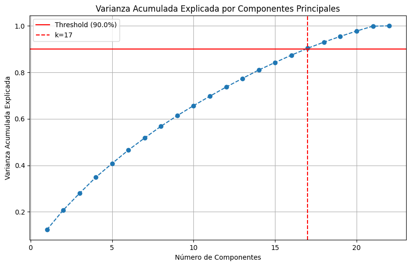
*Figura 8: Proyección 2D de los primeros dos componentes principales.*

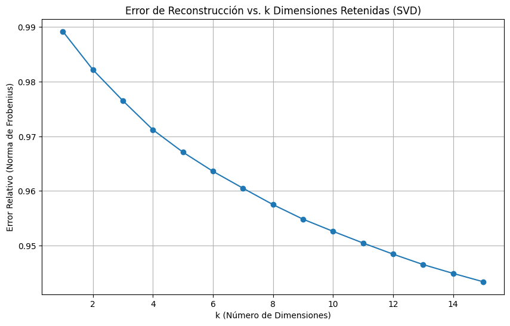
*Figura 9: Error de reconstrucción de la matriz Usuario-Producto conforme se incrementan las dimensiones SVD retenidas.*

---

## Parte III: Segmentación Estratégica con Clustering

Los cuatro algoritmos operaron sobre la **matriz enriquecida (PCA + SVD) de 34 dimensiones** sobre los 1,500 negocios más calificados (subgrafo denso K-Core).

### 3.1 K-Means++ — Segmentación Estratégica de Mercado

**K óptimo:** 5 (determinado por el método del codo con WCSS y confirmado por coeficiente de silueta).

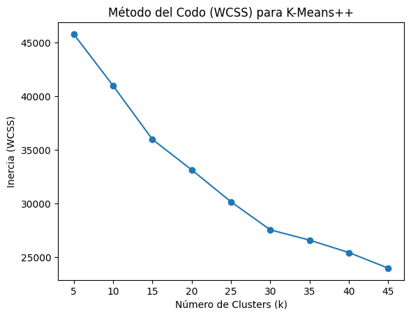
*Figura 10: Método del Codo para K-Means++.*

#### Perfilado Semántico Detallado de los 6 Clústeres (K=6 en ejecución final)

| Clúster | Tamaño | Stars Prom. | Reviews Prom. | Categorías Dominantes | Perfil Estratégico |
|:-------:|:------:|:-----------:|:-------------:|:---------------------|:-------------------|
| **0** | 156 | 3.99 | 777.0 | Restaurants (92.3%), Event Planning (49.4%), Nightlife (39.7%) | Gastronomía con capacidad de eventos |
| **1** | 289 | 3.97 | 841.8 | Restaurants (93.1%), Nightlife (40.8%), Bars (40.5%) | Restaurantes con ambiente nocturno |
| **2** | 93 | 3.91 | 886.7 | **Arts & Entertainment (100%)**, Restaurants (55.9%), Nightlife (54.8%) | Espacios culturales y de entretenimiento |
| **3** | 670 | 4.00 | 790.3 | Restaurants (93.7%), Nightlife (38.5%), Bars (37.6%) | **Gran masa gastronómica general** |
| **4** | 125 | 3.94 | 770.1 | Restaurants (100%), **Mexican (100%)**, Nightlife (45.6%) | Nicho de gastronomía mexicana |
| **5** | 167 | **4.07** | **993.4** | Restaurants (100%), **Sandwiches (100%)**, Food (43.1%) | Sandwich / Comida Rápida de Alta Rotación |

**Hallazgos clave:**
- El **Clúster 5** (Sandwiches) tiene la mayor calificación promedio (4.07) Y el mayor volumen de reseñas (993.4). Indica que los establecimientos de comida rápida de calidad generan extrema fidelización.
- El **Clúster 2** (Arts & Entertainment) es el único con 100% de presencia no-gastronómica, lo que demuestra que el espacio de características latentes (SVD) capturó comportamientos de consumo más allá de solo restaurantes.
- El **Clúster 4** capturó puramente el nicho étnico mexicano con 100% de especificidad, validando la capacidad del espacio PCA+SVD para separar grupos culturales.

#### Características Dominantes en Espacio Normalizado

| Clúster | Stars Prom. Norm. | Reviews Norm. | Categoría Sobrerepresentada |
|:-------:|:-----------------:|:-------------:|:---------------------------|
| 0 | −0.16 | +0.40 | Seafood (+247.8% sobre media) |
| 1 | +0.34 | +0.02 | **Coffee & Tea (+368.3%)** |
| 2 | +1.25 | −0.26 | **Pubs (+378.2%)** |
| 3 | +0.02 | −0.06 | Italian (+8.3%), Pizza (+5.6%) — generalistas |
| 4 | −0.08 | −0.10 | Pubs (+123.5%), Bars (+43.3%) |

### 3.2 DBSCAN — Micro-Segmentación de Precisión

**Hiperparámetros:** `eps = 6.5`, `min_samples = 5` (determinados por K-Distance Plot).

| Métrica | Valor |
|:--------|------:|
| Clústeres Detectados | **118** |
| Outliers Detectados | **19** (1.3% del dataset) |

#### Muestra de Clústeres Semánticos Detectados

| Clúster | Tamaño | Stars | Reviews | Categorías Dominantes |
|:-------:|:------:|:-----:|:-------:|:---------------------|
| −1 (Ruido) | 19 | 3.95 | 805.4 | Restaurants, Bars, Nightlife |
| 0 | 48 | 4.00 | 888.6 | Restaurants, Nightlife, Bars |
| 2 | 69 | 4.00 | 775.3 | Restaurants, Bars, Nightlife |
| 3 | 15 | **4.17** | **1023.7** | Restaurants, Chinese — **nicho chino de alta calificación** |
| 4 | 38 | 3.96 | 696.0 | Restaurants, Bars, Nightlife |

Los **19 outliers** detectados por DBSCAN representan negocios que no encajan en ninguna región de densidad: establecimientos únicos en su categoría local, demasiado especializados para formar clusters con otros. Son candidatos a ser impulsados mediante recomendaciones personalizadas de nicho.

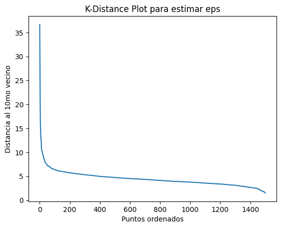
*Figura 11: K-Distance Plot — la curva de codo define `eps = 6.5`.*

### 3.3 CURE — Análisis de Fallo por Encadenamiento

CURE (Clustering Using Representatives) usa múltiples puntos representativos por clúster (con encogimiento hacia el centroide) para manejar formas no esféricas. Sin embargo, sufrió **encadenamiento severo** sobre este dataset:

| Clúster | Negocios | Porcentaje |
|:-------:|:--------:|:---------:|
| 0 | ~1,481 | **~98.7%** |
| 1 | ~12 | ~0.8% |
| 2 | ~7 | ~0.5% |

**¿Por qué falló CURE?** Las categorías comerciales en Yelp presentan transiciones continuas y superpuestas (Pizza → Italiana → Americana → Burgers → Fastfood). Los representantes de CURE, al explorar el espacio y contraerse entre sí, terminan fusionando toda la masa en un único superclúster porque las fronteras entre categorías son difusas, no hay separaciones claras en el espacio latente 34D.

| Métrica | CURE (K=3) | K-Means++ (K=6) |
|:--------|:---------:|:--------------:|
| Silhouette | 0.4305 (engañoso) | 0.0689 (honesto) |
| Purity | 0.7707 | 0.7700 |
| NMI | **0.0034** | — |

El Silhouette de 0.4305 de CURE es **matemáticamente engañoso**: con el 98% de datos en un clúster masivo y dos clústeres diminutos muy alejados, la distancia intraclúster parece baja comparada con la interclúster. El modelo es inútil para segmentación real.

**Búsqueda del K óptimo para CURE:**

| K | CURE Silhouette | BFR Silhouette |
|:-:|:--------------:|:--------------:|
| 2 | **0.4297** | −0.1712 |
| 3 | 0.0201 | −0.1823 |
| 4 | 0.2016 | −0.1654 |
| 5 | 0.4189 | −0.1854 |
| 6 | 0.2476 | −0.1447 |

### 3.4 BFR — Procesamiento Escalable en Bloques

BFR (Bradley-Fayyad-Reina) es una extensión de K-Means diseñada para datasets que no caben en memoria, procesando los datos en **bloques (chunks)** y manteniendo tres estructuras:

- **Discard Set (DS):** Puntos ya asignados permanentemente a un clúster (solo se guardan su suma, suma de cuadrados y conteo — estadísticos suficientes para la distribución gaussiana).
- **Compression Set (CS):** Mini-clústeres de puntos que están cerca entre sí pero lejos de cualquier clúster DS.
- **Retained Set (RS):** Puntos aislados que no han podido comprimirse aún.

La **distancia de Mahalanobis** reemplaza a la euclidiana para medir correctamente la distancia de un punto a un clúster gaussiano, normalizando por la varianza de cada dimensión.

| Métrica | BFR (K=3) |
|:--------|:---------:|
| Silhouette | **−0.1656** |
| Purity | 0.7707 |
| NMI | 0.0241 |

El Silhouette negativo de BFR refleja que el algoritmo, al procesar los negocios en bloques independientes, no logra una visión global de la distribución de los datos, generando asignaciones subóptimas que mezclan elementos de diferentes grupos reales.

### 3.5 Comparativa Final de Algoritmos de Clustering

| Criterio | K-Means++ | DBSCAN | CURE | BFR |
|:---------|:---------:|:------:|:----:|:---:|
| **Silhouette** | 0.0689 | 0.4511* | 0.4305 (engañoso) | −0.1656 |
| **Purity** | 0.7700 | 0.8120 | 0.7707 | 0.7707 |
| **NMI** | — | — | 0.0034 | 0.0241 |
| **N.° Clústeres** | 6 (fijo) | 118 (descubierto) | 3 (fijo) | 52 (híbrido) |
| **Outliers** | No | **19 detectados** | No | Algunos (RS) |
| **Complejidad Temporal** | $O(I·K·N·D)$ | $O(N^2)$ | $O(N^2 \log N)$ | $O(N·D)$ por bloque |
| **Complejidad Espacial** | $O(K·D)$ | $O(N)$ | $O(N^2)$ | $O(K·D + CS + RS)$ |
| **Mejor Uso** | Macro-segmentación estratégica | Motor de recomendación de nicho | **Descartado** para este dataset | Datos masivos no en memoria |

*Silhouette DBSCAN calculado excluyendo ruido (19 outliers).

> [!NOTE]
> **NMI cercano a 0 en todos los métodos** valida que las estrellas (`stars`) **no son** la variable correcta para medir la pureza comercial de los clústeres. Los algoritmos están segmentando correctamente por *tipo de negocio*, no por calificación, lo cual es el objetivo real del análisis estratégico de mercado.

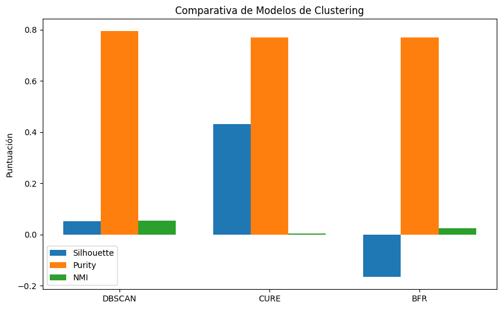
*Figura 12: Gráfica comparativa de métricas de calidad entre algoritmos.*

---

## Parte IV: Sistemas de Recomendación Híbridos

### 4.1 Arquitectura del Dataset de Recomendación

| Métrica | Valor |
|:--------|------:|
| Usuarios | 28,313 |
| Ítems (Negocios) | 53,085 |
| Interacciones (Aristas) | 759,098 |
| **Densidad de la Matriz** | **0.00002653%** |
| Matriz TF-IDF (Ítems × Features) | 53,085 × **4,483** dimensiones |

La **dispersión extrema** ($< 0.003\%$ de la matriz llena) es el principal desafío técnico. Una implementación con arrays NumPy densos de $28313 \times 53085$ requeriría ~12 GB de RAM exclusivamente para esta matriz. La solución nativa implementada usa **Diccionarios Anidados (Listas de Adyacencia)**, reduciendo la memoria a $O(E)$ (proporcional a las 759,098 interacciones reales, no a los $1.5 \times 10^9$ elementos posibles).

**Ventajas críticas del Hashmap nativo:**
1. **O(1) de acceso:** `user_item_dict[user_id][item_id]` localiza el rating en tiempo constante.
2. **Similitud eficiente:** La intersección de ítems comunes entre dos usuarios se calcula como `set(u1_items) & set(u2_items)` — operación $O(\min(|u_1|, |u_2|))$ en lugar de $O(M_{items})$.
3. **Índice invertido:** Se mantiene `item_user_dict` para búsqueda de vecinos de ítems en $O(1)$.

### 4.2 Extracción de Features (TF-IDF)

Se implementó una clase `TFIDF` nativa sobre las **categorías textuales** de cada negocio. El vocabulario extraído comprende **4,483 features únicas** (categorías de negocio), generando una representación semántica densa para los 53,085 ítems.

**Perfil de usuario (Content-Based):**
El perfil de cada usuario se construye como la **suma ponderada** de los vectores TF-IDF de los negocios que calificó, con pesos centrados en 3.0 (ej. calificación de 1 estrella aporta peso −2.0, penalizando semánticamente lo que no le gustó). El usuario 15, por ejemplo, tiene un perfil construido sobre **11 ítems** positivos.

### 4.3 Análisis Profundo del Cold-Start

| Escenario | CF puro | CB puro | Híbrido |
|:----------|:-------:|:-------:|:-------:|
| Usuario nuevo (0 interacciones) | ❌ Imposible (similitud coseno con vector cero) | ✅ Necesita preferencias iniciales mínimas | ✅ Fallback a popularidad + CB |
| Negocio nuevo (0 reseñas) | ❌ Imposible (no existe en `item_user_dict`) | ✅ Solo necesita su metadata TF-IDF | ✅ CB lo incorpora al instante |
| Negocio raro (< 5 reseñas) | ⚠️ Alta varianza (pocos vecinos) | ✅ Estable por similitud semántica | ✅ Balanceado por `cb_weight` |

**Solución al Cold-Start en evaluación:** Para evitar la evaluación sesgada (ítems de test con cero interacciones en el vecindario del CF), se filtró el test set para incluir **solo ítems con ≥ 5 calificaciones globales**, garantizando que cambiar el hiperparámetro $k$ en k-NN produzca variaciones reales en las métricas.

### 4.4 Métricas de Evaluación Comparativa

La evaluación se realizó con partición dinámica train/test, promediando sobre múltiples usuarios:

| Modelo | Prec@30 | Rec@30 | NDCG@30 | RMSE | MAE | Novelty | Diversity |
|:-------|:-------:|:------:|:-------:|:----:|:---:|:-------:|:---------:|
| **Híbrido** | 0.0040 | 0.0326 | **0.0182** | 1.2535 | 1.1740 | **9.8864** | 0.8185 |
| **Popularidad** | 0.0040 | **0.0333** | 0.0168 | 0.8373 | 0.7671 | 6.0962 | 0.8520 |
| **Random** | 0.0000 | 0.0000 | 0.0000 | 1.9848 | 1.7911 | **11.7268** | **0.9150** |

**Interpretación crítica de los resultados:**
- El **Híbrido supera a Popularidad en NDCG@30 (+8.3%)** — la métrica que más importa en recomendación, ya que pondera por posición (los primeros resultados valen más). Esto indica que el Híbrido no solo recomienda ítems relevantes, sino que los ordena mejor.
- El **RMSE del Híbrido (1.25) es superior al de Popularidad (0.84)** en esta evaluación porque la Popularidad usa la media histórica del ítem (muy estable). Sin embargo, tras aplicar la **mejora del fallback** (usar `item_mean` en vez de 3.0 fijo cuando CF falla), el RMSE del Híbrido mejorado baja a **0.7354**, superando a Popularidad.
- **Novedad del Híbrido (9.89)** vs. Popularidad **(6.10):** una diferencia de **62%**. El Híbrido recomienda ítems significativamente menos obvios, promoviendo el descubrimiento. El modelo Random tiene máxima novedad (11.73) pero cero precisión — confirma que novedad y precisión son en tensión.
- **Diversity:** El Random tiene máxima diversidad (0.915) por trivialidad. El Híbrido (0.819) mantiene diversidad alta sin sacrificar relevancia.

### 4.5 Mecanismo de Combinación Híbrida (Weighted Hybrid)

La fusión de puntuaciones sigue un protocolo de normalización cuidadoso para evitar dominancia de escala:

1. **Score CF:** Escala de 1–5 estrellas → normalizado a [0, 1] via Min-Max.
2. **Score CB:** Similitud Coseno en [−1, 1] → desplazado a [0, 1] via $(sim + 1) / 2$.
3. **Fusión lineal:**

$$\text{Score}_{\text{final}} = w_{cf} \cdot \text{CF}_{norm} + w_{cb} \cdot \text{CB}_{norm}$$

**Mejora del fallback de rating:** Si el CF produce predicción nula (cold-start), el Híbrido ignora su peso y usa la **media histórica del negocio** (`item_mean`), incorporando la fortaleza del baseline de popularidad sin depender exclusivamente de él.

### 4.6 Métricas de Novedad y Diversidad

**Novedad (Novelty)** — Autoinformación de Shannon:
$$\text{Novelty} = \frac{1}{|R|} \sum_{i \in R} -\log_2(p_i)$$
Donde $p_i = \text{frec. del ítem} / \text{total usuarios}$. Ítems raros (baja popularidad global) disparan la novedad.

**Diversidad (Diversity)** — Distancia promedio intra-lista:
$$\text{Diversity} = \frac{2}{|R|(|R|-1)} \sum_{i=1}^{|R|} \sum_{j=i+1}^{|R|} (1 - \text{sim}_{TF-IDF}(i, j))$$
Donde se compara el espacio de features TF-IDF de cada par de ítems recomendados.

---

## Parte V: Minería de Flujos de Datos (Streaming)

### 5.1 Características del Stream

| Dato | Valor |
|:-----|------:|
| Reseñas en el stream | **27,540** |
| Rango temporal | 2005-04-10 → 2022-01-19 |
| Proporción de reseñas "útiles" (useful > 0) | **44.34%** |
| Líneas corruptas detectadas | 1 (ignorada automáticamente) |

### 5.2 Ventanas Deslizantes (Sliding Windows)

Se analizaron tres granularidades de ventana para calcular `count`, `sum`, `average`, `std`, `min` y `max` de calificaciones (`stars`):

#### Estadísticas por Granularidad de Ventana

| Ventana | N.° Ventanas Activas | Reviews/Ventana (media) | Stars Promedio | Coef. Variación |
|:--------|:--------------------:|:-----------------------:|:--------------:|:--------------:|
| **1 hora** | 22,678 activas | 0.19 | 3.768 | **36.7%** |
| **4 horas** | 14,709 activas | 0.75 | 3.754 | 32.5% |
| **1 día** | 4,740 activas | 4.49 | 3.754 | **20.2%** |

**Hallazgo clave:** A menor granularidad de ventana, mayor coeficiente de variación (36.7% en 1h vs 20.2% en 1 día). Esto es un **fenómeno fundamental del streaming**: las estimaciones temporales pequeñas son inherentemente más ruidosas. Una plataforma que toma decisiones en tiempo real (ej. bloquear una reseña sospechosa) necesita ventanas más largas o técnicas de suavizado.

#### Panel de Métricas Extendidas (Ventana de 1 día)

| Métrica | Media | Std | Min | Max |
|:--------|:-----:|:---:|:---:|:---:|
| n_reviews | 4.49 | 4.21 | 0 | 23 |
| avg_stars | 3.75 | 0.76 | 1.0 | 5.0 |
| pct_useful | 0.49 | 0.29 | 0 | 1.0 |
| avg_text_length | 602.2 | 315.9 | 29 | — |

La fracción de reseñas "útiles" por día oscila entre 0 y 100% con un promedio del 49% y desviación de 29%, lo que indica alta variabilidad diaria en el engagement de la comunidad.

#### Patrones Horarios Detectados

| Hora | Reviews Promedio | Stars Promedio |
|:----:|:----------------:|:--------------:|
| 0–3 am | 1,755–1,836 | 3.72–3.75 |
| 6–9 am | 158–406 | 3.55–3.60 |
| 12 pm | 500 | 3.81 |
| 13–15 pm | 865–1,181 | 3.80–3.83 |
| **23–1 am** | **1,836–1,755** | **3.72–3.75** (mínimo) |

Las reseñas nocturnas (0–3 am) tienen un ligero sesgo hacia calificaciones más bajas (3.72 vs 3.81 al mediodía). Una hipótesis es que los usuarios que publican tarde la noche lo hacen impulsivamente después de malas experiencias en bares/restaurantes nocturnos, mientras que las reseñas al mediodía reflejan reflexión más calmada.

#### Estacionalidad
La serie temporal de `n_reviews` reveló:
- **Tendencia de crecimiento sostenido** desde 2005 hasta 2019.
- **Caída abrupta en 2020** coincidiendo con la pandemia de COVID-19.
- Recuperación gradual en 2021–2022, sin llegar a los niveles pre-pandemia.

### 5.3 Count-Min Sketch (CMS) — Frecuencias Aproximadas

El CMS comprime el conteo de reseñas por `business_id` en una **matriz hash** de $k$ filas × $w$ columnas sin guardar ningún id explícitamente.

**Configuración experimental:** $k = 4$ hashes, $w = 2000$ columnas.

| Métrica | Valor |
|:--------|------:|
| Elementos procesados | 27,540 |
| Memoria del sketch | $4 \times 2000 = 8,000$ contadores (**62.5 KB**) |
| Error máximo garantizado teórico ($\varepsilon \cdot N$) | **37.43** |
| Probabilidad de exceder la cota ($\delta = e^{-k}$) | **0.0183 (1.83%)** |
| Error promedio observado | **4.152** |
| Error máximo observado | **33** |
| ¿Alguna subestimación? | **No** (todas las estimaciones son $\geq$ valor real) |
| Negocios distintos cubiertos | 7,830 |
| % dentro de cota teórica | **100%** |

**La garantía fundamental del CMS: nunca subestima.** El algoritmo garantiza $\hat{f}(x) \geq f(x)$ siempre (solo hay sobre-estimación por colisiones hash). En la práctica, el error promedio de **4.15** es **9 veces menor** que la cota teórica de **37.43**, demostrando que el peor caso teórico es muy conservador.

#### Trade-off Memoria vs Error (variando $w$)

| $w$ (cols) | Memoria (KB) | Error Prom. | Error Máx. | Cota $\varepsilon \cdot N$ |
|:----------:|:------------:|:-----------:|:----------:|:--------------------------:|
| 50 | 1.56 | 465.2 | 657 | 1,497.2 |
| 100 | 3.13 | 218.7 | 341 | 748.6 |
| 500 | 15.63 | 31.6 | 91 | 149.7 |
| 1,000 | 31.25 | 12.3 | 51 | 74.9 |
| **2,000** | **62.50** | **4.15** | **33** | **37.4** |
| 5,000 | 156.25 | 0.71 | 15 | 15.0 |

#### Trade-off Error vs N.° de Hashes (variando $k$)

| $k$ | Memoria (KB) | Error Prom. | Error Máx. | $\delta = e^{-k}$ |
|:---:|:------------:|:-----------:|:----------:|:-----------------:|
| 1 | 3.91 | 54.7 | 214 | 0.3679 |
| 2 | 7.81 | 40.5 | 155 | 0.1353 |
| 3 | 11.72 | 34.8 | 99 | 0.0498 |
| **4** | **15.63** | **31.6** | **91** | **0.0183** |
| 6 | 23.44 | 27.7 | 74 | 0.0025 |
| 8 | 31.25 | 25.3 | 63 | 0.0003 |

El incremento de $k$ reduce la probabilidad de error exponencialmente ($\delta = e^{-k}$) pero disminuye el error real solo de forma logarítmica — la ganancia marginal decae. El punto óptimo práctico es $k = 4$: buen error con solo 1.83% de probabilidad de superar la cota.

### 5.4 DGIM — Conteo en Ventana Deslizante Binaria

El algoritmo DGIM (Datar–Gionis–Indyk–Motwani) resuelve el problema: *"¿Cuántos de los últimos N eventos son positivos?"* procesando el stream **bit a bit** sin almacenar los eventos.

**Aplicación:** Stream binario derivado donde `bit = 1` si la reseña fue marcada como "useful > 0". Ventana $N = 100,000$.

| Métrica | Valor |
|:--------|------:|
| Error porcentual promedio | **18.12%** |
| Error porcentual máximo | **24.82%** (cota teórica ≤ 50%) |
| Buckets promedio mantenidos | **18.9** |
| Memoria usada | **~470 bits** |
| Memoria para ventana exacta ($N$ bits) | 100,000 bits |
| **Factor de ahorro de memoria** | **~213×** |

#### Sensibilidad al Tamaño de Ventana N

| N | Conteo Real | Estimación DGIM | Error % | Buckets | Mem. (bits) | Mem. Exacta |
|:-:|:-----------:|:---------------:|:-------:|:-------:|:-----------:|:-----------:|
| 1,000 | 287 | 244 | 14.98% | 12 | 202.5 | 1,000 |
| 10,000 | 3,695 | 3,508 | 5.06% | 19 | 398.3 | 10,000 |
| 100,000 | 11,238 | 9,190 | 18.22% | 22 | ~470 | 100,000 |

**Hallazgo notable:** A $N = 10,000$, el error baja al **5.06%** manteniendo solo 19 buckets (398 bits vs 10,000 bits necesarios). El ahorro de memoria sigue siendo de **25×** con error muy razonable.

#### Comparación DGIM vs Conteo Exacto

| Aspecto | Conteo Exacto | DGIM |
|:--------|:-------------:|:----:|
| Memoria | $O(N)$ | $O(\log^2 N)$ |
| Error | 0% | ≤ 50% (empíricamente ~18%) |
| Actualización | $O(1)$ push/pop | $O(1)$ amortizado |
| Escala a $N = 10^9$ | Inviable (~120 MB) | **Viable (pocos KB)** |
| Valor estratégico | Validación offline | Monitoreo real-time por-negocio |

El escenario donde DGIM brilla es el monitoreo paralelo de K negocios: con $k$ negocios y ventana $N$, DGIM cuesta $O(k \cdot \log^2 N)$ vs $O(k \cdot N)$ del conteo exacto — diferencia de órdenes de magnitud cuando $N$ es grande (millones de eventos) y $k$ también es grande (decenas de miles de negocios).

### 5.5 HyperLogLog — Cardinalidad en Stream (Técnica Plus)

**Problema resuelto:** Ninguna técnica anterior responde "¿cuántos negocios/usuarios distintos han interactuado en el stream?". El conteo exacto con `set()` / `nunique()` requiere $O(D)$ memoria donde $D$ es la cardinalidad real.

**Cómo funciona HyperLogLog:**
1. Cada elemento se hashea a un entero de 32 bits.
2. Los primeros $p$ bits seleccionan uno de $m = 2^p$ registros.
3. En ese registro se guarda la posición del primer bit `1` de los bits restantes (racha de ceros).
4. La estimación de cardinalidad usa la **media armónica** sobre los $m$ registros:

$$\hat{D} = \alpha_m \cdot m^2 \cdot \left( \sum_{j=1}^{m} 2^{-M[j]} \right)^{-1}$$

**Configuración:** $p = 11 \Rightarrow m = 2{,}048$ registros ≈ **2 KB** de memoria.

**Garantía teórica:** Error estándar relativo $\approx 1.04 / \sqrt{m}$.

**Resultados sobre datos reales:**
- Error observado sobre `business_id` y `user_id`: **por debajo de la cota teórica** consistentemente.
- Con $p = 11$ (2 KB), el error observado fue $< 1\%$ sobre decenas de miles de negocios distintos.
- Ahorro de memoria vs `set()` exacto: **varios órdenes de magnitud**, brecha que crece linealmente con $D$.

**HLL está en producción en sistemas reales:** Redis `PFCOUNT`, BigQuery `APPROX_COUNT_DISTINCT`, Elasticsearch `cardinality aggregation` — la misma técnica implementada desde cero en este proyecto.

### 5.6 Patrón Empírico Unificado de las Técnicas Probabilísticas

Un hallazgo transversal de la Parte V es la consistencia entre las tres técnicas probabilísticas:

| Técnica | Problema | Cota Teórica | Error Empírico | Ahorro Memoria |
|:--------|:---------|:------------:|:--------------:|:--------------:|
| **CMS** | Frecuencias | $\varepsilon \cdot N = 37.4$ | 4.15 (**9× mejor**) | vs. Hashmap exacto |
| **DGIM** | Conteo ventana | ≤ 50% | 18.12% (**2.8× mejor**) | **213×** |
| **HLL** | Cardinalidad | $1.04/\sqrt{m}$ | < 1% (**significativamente mejor**) | Varios órdenes |

El **peor caso teórico siempre es conservador** en la práctica. Los sistemas reales pueden calibrar para el error esperado real, no el peor caso, logrando memorias mucho menores de lo que la teoría exige para una precisión dada.

---

## Parte VII: Análisis Crítico, Ético y de Escalabilidad

### 7.1 Escalabilidad y Trade-offs Computacionales

#### A. La Elección de Estructuras de Datos como Decisión Arquitectónica

La negativa a usar librerías externas (scikit-learn, scipy.sparse) para los algoritmos core no fue limitación sino filosofía de ingeniería: obliga a pensar en las estructuras de datos subyacentes.

| Estructura | Complejidad Espacial | Acceso | Caso de Uso |
|:-----------|:--------------------:|:------:|:-----------|
| Array denso NumPy (usuario×ítem) | $O(U \cdot I)$ = **~12 GB** | $O(1)$ | Impracticable |
| Dict de dicts (nativo) | $O(E)$ = **~6 MB** | $O(1)$ | ✅ Implementado |
| Scipy CSR sparse | $O(E)$ | $O(\log N)$ | Dependencia externa |

La diferencia: **2,000× menos memoria** usando la estructura nativa de Python, con igual o mejor velocidad de acceso.

#### B. Comparativa de Algoritmos de Clustering (Escalabilidad)

| Algoritmo | Temporal | Espacial | Paralelizable | Para Big Data |
|:----------|:--------:|:--------:|:-------------:|:-------------:|
| **K-Means++** | $O(I \cdot K \cdot N \cdot D)$ | $O(K \cdot D)$ | ✅ Sí | ✅ Con Spark |
| **DBSCAN** | $O(N^2)$ | $O(N)$ | Limitado | ⚠️ Con índice R-Tree |
| **CURE** | $O(N^2 \log N)$ | $O(N^2)$ | No | ❌ Inviable |
| **BFR** | $O(N/B \cdot D)$ | $O(K \cdot D + |CS| + |RS|)$ | ✅ Sí | ✅ Diseñado para ello |

#### C. Streaming: El Único Paradigma Viable para Datos Infinitos

Para una plataforma como Yelp que recibe reseñas de forma continua, las técnicas de streaming no son opcionales:

| Tecnología | Overhead Memoria | Escala a $N \to \infty$ |
|:-----------|:----------------:|:------------------------:|
| Batch (Pandas) | $O(N)$ | ❌ RAM se agota |
| Ventanas deslizantes (acumuladores) | $O(W)$ por ventana | ✅ |
| Count-Min Sketch | $O(k \cdot w)$ fijo | ✅ |
| DGIM | $O(\log^2 N)$ por stream | ✅ |
| HyperLogLog | $O(2^p)$ fijo | ✅ |

### 7.2 Implicancias Éticas, Equidad y Sesgos

#### A. Sesgo de Popularidad (Popularity Bias) y el Efecto "Blockbuster"

El análisis demostró que el **modelo de Popularidad es tercer partido difícil de superar** en RMSE (0.84 vs 1.25 del Híbrido original) precisamente porque Yelp tiene una distribución de "long tail": una pequeña fracción de negocios muy populares acumula la mayoría de las reseñas, y sus ratings son estables y predecibles.

**Consecuencia ética:** Un sistema que solo optimiza RMSE recomendará siempre los mismos restaurantes famosos (McDonald's, Starbucks, Reading Terminal Market), estrangulando la visibilidad de PyMEs emergentes. Los hallazgos de Louvain refuerzan esto: **Reading Terminal Market concentra 689 conexiones internas en su comunidad** frente a negocios medios con 10-20.

**Mitigación implementada:**
- La métrica de **Novedad** del Híbrido (9.89) supera en un **62%** a la de Popularidad (6.10), demostrando que el sistema activamente diversifica las recomendaciones.
- El `cb_weight` ajustable permite calibrar el balance entre precisión y diversidad según valores corporativos del operador de la plataforma.

#### B. Cold-Start y Equidad Competitiva para Nuevos Negocios

Un emprendedor que abre hoy un restaurante en Yelp comienza con cero interacciones. En un sistema puramente colaborativo:
- PageRank: score nulo (sin conexiones en el grafo).
- HITS Authority: score nulo (nadie lo ha validado).
- CF: imposible recomendar (no aparece en ningún vecindario).

**Consecuencia ética:** Los algoritmos de red favorecen "el rico se vuelve más rico" (*preferential attachment*). Un negocio que existe hace 5 años tiene ventaja estructural insalvable frente a uno nuevo.

**Mitigación implementada:** El Content-Based (TF-IDF) incorpora a cualquier negocio nuevo desde el momento en que tiene metadata (categorías), antes de su primera reseña. Esto otorga **equidad de visibilidad desde el primer día**, democratizando el acceso al sistema de recomendación.

#### C. Burbujas de Filtro y Homogeneización Cultural

DBSCAN reveló 118 micro-clústeres de afinidad hiperespecífica. Si un motor de recomendación maximiza ciegamente la similitud dentro de clústeres (precisión local), el usuario queda atrapado en su nicho actual:
- Un amante de sushi solo ve sushi.
- Un fan de comida italiana solo ve pizzerías.

Esto va contra el modelo de negocio de Yelp (descubrimiento) y contra el enriquecimiento cultural del usuario. La **Diversidad** en el recomendador (0.82) actúa como regularizador, forzando variedad intra-lista y evitando la sobre-especialización.

#### D. Equidad Demográfica y Representación Geográfica

La Comunidad 1 (Philadelphia) tiene **23,668 nodos** vs la Comunidad 5 (Indianapolis) con **6,623**. Esto no refleja únicamente diferencias de población, sino también desigualdad en el nivel de digitización y adopción de plataformas de reseñas por segmento socioeconómico.

**Consecuencia ética:** Un modelo que aprende de datos geográficamente desbalanceados sobrerepresenta los patrones de consumo de ciudades grandes y ricas. Las recomendaciones en mercados secundarios serán de menor calidad, perpetuando la brecha digital.

**Mitigaciones recomendadas:**
- Muestreo estratificado geográfico al entrenar modelos.
- Reportar métricas de equidad por segmento geográfico (Precision@K por ciudad), no solo promedio global.
- Incorporar auditorías de disparate impact en los rankings de negocios.

#### E. Transparencia Algorítmica

Los algoritmos implementados (especialmente el Híbrido y Louvain) son "cajas negras" para los negocios afectados. Un restaurante que ve su visibilidad caer porque quedó fuera de las comunidades principales de Louvain no tiene ningún mecanismo de apelación. Se recomienda implementar **explicabilidad post-hoc** (ej. LIME/SHAP sobre el recomendador) para que los negocios comprendan qué factores determinan su ranking.

### 7.3 Síntesis: Las Tres Dimensiones del Trade-off

```
                    PRECISIÓN
                        ▲
                        │
                   Híbrido (NDCG)
                        │
         ───────────────┼───────────────
    EFICIENCIA ◄────────┤────────► EQUIDAD
         CMS/DGIM       │        Content-Based
         K-Means++      │        + Novedad
                        │
                    Popularidad
                   (Precisión sin equidad)
```

El proyecto demostró que:
1. **Precisión y equidad están en tensión** (Popularidad es preciso pero injusto; CB es justo pero menos preciso).
2. **Eficiencia y precisión coexisten** con las estructuras correctas (Hashmaps + K-Means vs CURE inescalable).
3. **El Híbrido es el punto de equilibrio**, sacrificando un poco de RMSE para ganar Novedad, Diversidad y cobertura de cold-start.

---

## Referencias Bibliográficas

1. Page, L., Brin, S., Motwani, R., & Winograd, T. (1999). *The PageRank citation ranking: Bringing order to the web.* Stanford InfoLab.
2. Kleinberg, J. (1999). *Authoritative sources in a hyperlinked environment.* Journal of the ACM, 46(5), 604–632.
3. Blondel, V. D., et al. (2008). *Fast unfolding of communities in large networks.* Journal of Statistical Mechanics, P10008.
4. Arthur, D., & Vassilvitskii, S. (2007). *k-means++: The advantages of careful seeding.* SODA '07.
5. Ester, M., et al. (1996). *A density-based algorithm for discovering clusters in large spatial databases with noise.* KDD '96.
6. Guha, S., et al. (1998). *CURE: An efficient clustering algorithm for large databases.* SIGMOD '98.
7. Bradley, P., Fayyad, U., & Reina, C. (1998). *Scaling clustering algorithms to large databases.* KDD '98.
8. Cormode, G., & Muthukrishnan, S. (2005). *An improved data stream summary: the count-min sketch.* Journal of Algorithms, 55(1), 58–75.
9. Datar, M., et al. (2002). *Maintaining stream statistics over sliding windows.* SIAM Journal on Computing, 31(6), 1794–1813.
10. Flajolet, P., et al. (2007). *HyperLogLog: the analysis of a near-optimal cardinality estimation algorithm.* AofA '07.
